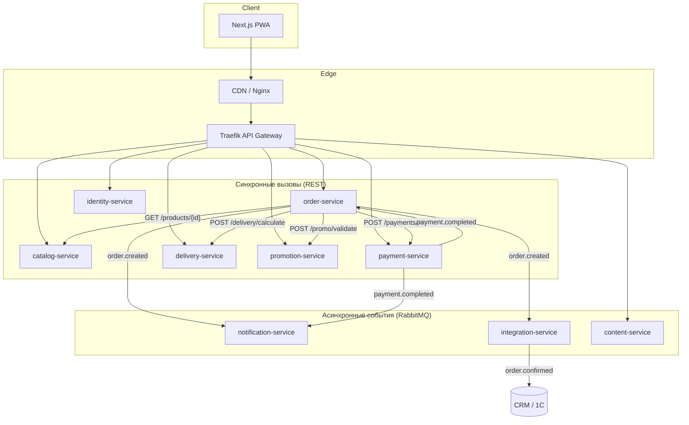

# Архитектура Beefshteks — микросервисная платформа доставки еды

## 1. Декомпозиция на bounded contexts

| # | Сервис | Bounded Context | Обоснование разделения |
|---|--------|-----------------|------------------------|
| 1 | **catalog-service** | Каталог и поиск | Меню меняется редко, но читается очень часто. Отдельный сервис + Meilisearch позволяет масштабировать чтение независимо от checkout. |
| 2 | **order-service** | Заказ и корзина | Центральный transactional context. Высокая нагрузка в пиковые часы. Redis для корзины, PostgreSQL для заказов. |
| 3 | **identity-service** | Пользователь и авторизация | SMS OTP, JWT, адреса — отдельная зона ответственности с особыми требованиями безопасности (152-ФЗ). |
| 4 | **payment-service** | Платежи | PCI DSS, идемпотентность, webhooks — изолирован от остальной логики. |
| 5 | **notification-service** | Уведомления | SMS + Web Push. Асинхронная обработка, retry-логика, шаблоны. |
| 6 | **delivery-service** | Доставка и геокодинг | Интеграции DaData/Яндекс.Карты, зоны доставки — меняются независимо от меню. |
| 7 | **content-service** | Контент и SEO | Отзывы, блог, статические страницы. CMS-логика не должна нагружать catalog. |
| 8 | **promotion-service** | Промо и скидки | Правила акций сложны и часто меняются. Изоляция предотвращает регрессии в checkout. |
| 9 | **integration-service** | Внешние интеграции | CRM (МойСклад/1С), anti-corruption layer. Сбой CRM не блокирует приём заказов. |
| 10 | **media-service** | Медиа | S3/MinIO, WebP-конвертация, CDN URLs. IO-heavy, масштабируется отдельно. |
| 11 | **frontend** (Next.js) | Presentation | SSR для SEO, PWA, Service Worker. BFF-паттерн через API Gateway. |
| 12 | **api-gateway** (Traefik) | Edge routing | Rate limiting, TLS termination, маршрутизация, CORS. |

### Что сознательно НЕ выделяем в отдельный сервис

- **Analytics** — Яндекс.Метрика и GA4 на фронтенде; server-side events через RabbitMQ → ClickHouse (фаза 2).
- **Admin panel** — отдельный Next.js app, обращается к admin-эндпоинтам каждого сервиса через gateway с RBAC.

---

## 2. Схема взаимодействия



### Протоколы

| Взаимодействие | Протокол | Когда |
|----------------|----------|-------|
| Frontend → Gateway → Service | REST/JSON | CRUD, checkout, auth |
| order → catalog/promo/delivery | REST (sync) | Нужен немедленный ответ при checkout |
| order → notification/integration | RabbitMQ (async) | Fire-and-forget после commit |
| payment → order | RabbitMQ event `payment.completed` | Webhook от шлюза |
| Межсервисная авторизация | JWT (service-to-service) или mTLS в K8s | Prod |

### Базы данных (Database per Service)

| Сервис | Primary DB | Cache/Search | Почему |
|--------|-----------|--------------|--------|
| catalog | PostgreSQL | Meilisearch + Redis | PG — источник истины; Meili — полнотекстовый поиск по названию/ингредиентам |
| order | PostgreSQL | Redis (корзина) | ACID для заказов; Redis — ephemeral cart с TTL |
| identity | PostgreSQL | Redis (OTP codes) | OTP живут 5 мин, не нужны в PG |
| payment | PostgreSQL | — | Транзакции, audit trail |
| notification | PostgreSQL | Redis (rate limit) | Логи отправок, шаблоны |
| delivery | PostgreSQL | Redis (geo cache) | Зоны, тарифы; кеш адресов |
| content | PostgreSQL | — | Отзывы, статьи, SEO metadata |
| promotion | PostgreSQL | Redis (hot promos) | Правила скидок |
| integration | PostgreSQL | — | Sync logs, dead letter queue |
| media | MinIO (S3) | CDN | Бинарные файлы не в PG |

---

## 3. Файловая структура (монорепозиторий)

```
beefshteks/
├── .github/workflows/ci-cd.yml    # CI/CD pipeline
├── .env.example                    # Шаблон переменных окружения
├── docker-compose.yml              # Локальный запуск всего стека
├── README.md
│
├── docs/
│   ├── ARCHITECTURE.md             # Этот документ
│   ├── DEPLOYMENT.md               # Runbook деплоя
│   └── api/                        # OpenAPI specs (генерируются из FastAPI)
│
├── packages/
│   └── beefshteks-common/          # Shared Pydantic schemas, event types
│       ├── pyproject.toml
│       └── beefshteks_common/
│           ├── events.py           # EventTopic, OrderStatus enums
│           └── schemas.py          # OrderCreatedEvent и др.
│
├── services/
│   ├── order-service/              # ★ Полная реализация (центральный сервис)
│   │   ├── Dockerfile
│   │   ├── requirements.txt
│   │   ├── alembic.ini             # Миграции БД
│   │   ├── alembic/
│   │   ├── app/
│   │   │   ├── main.py             # FastAPI app, lifespan, metrics
│   │   │   ├── config.py           # Pydantic Settings
│   │   │   ├── models.py           # SQLAlchemy ORM entities
│   │   │   ├── schemas.py          # Request/Response DTO
│   │   │   ├── routes.py           # API endpoints
│   │   │   ├── services.py         # Business logic
│   │   │   ├── repositories.py     # Redis cart + HTTP clients
│   │   │   └── database.py         # Async SQLAlchemy session
│   │   └── tests/
│   │       └── test_cart.py
│   │
│   ├── catalog-service/            # Меню, поиск
│   ├── identity-service/           # Auth, users
│   ├── payment-service/            # Payments
│   ├── notification-service/       # SMS, push
│   ├── delivery-service/           # Geocoding, fees
│   ├── content-service/            # Reviews, blog
│   ├── promotion-service/          # Promo codes
│   └── integration-service/        # CRM sync
│
├── frontend/                       # Next.js 14 PWA (фаза 2)
│   ├── app/                        # App Router, SSR pages
│   ├── components/                 # UI components
│   ├── public/sw.js                # Service Worker
│   └── next.config.js              # PWA, image optimization
│
└── infra/
    ├── postgres/init-databases.sql # Database-per-service init
    ├── k8s/                        # Kubernetes manifests
    │   └── order-service.yaml
    ├── traefik/                    # Gateway config
    └── monitoring/                 # Grafana dashboards, Prometheus rules
```

### Почему монорепозиторий

- Команда 3–5 человек, срок 50–60 дней — мультирепо добавит overhead.
- Shared schemas (`beefshteks-common`) версионируются вместе.
- Единый CI/CD pipeline, atomic changes across services.
- При росте команды > 10 человек — можно split по bounded context.

---

## 4. Ключевые компоненты по сервисам

### 4.1 catalog-service

**Модели:** `Category`, `Product`, `ProductTag`, `ProductImage`, `Ingredient`

**API:**
```
GET    /api/v1/categories
GET    /api/v1/categories/{slug}
GET    /api/v1/products?category=&tags=&min_price=&max_price=&sort=
GET    /api/v1/products/{id}
GET    /api/v1/products/{id}/recommendations
GET    /api/v1/search?q=&autocomplete=true
```

### 4.2 order-service (★ реализован)

**Модели:** `Order`, `OrderItem`

**API:**
```
GET    /api/v1/cart                          # X-Session-Id header
POST   /api/v1/cart/items
PATCH  /api/v1/cart/items/{product_id}
DELETE /api/v1/cart/items/{product_id}
POST   /api/v1/cart/promo
POST   /api/v1/orders/checkout
GET    /api/v1/orders/{id}
GET    /api/v1/orders/user/{user_id}
```

### 4.3 identity-service

**Модели:** `User`, `Address`, `OtpCode`, `RefreshToken`

**API:**
```
POST   /api/v1/auth/otp/send
POST   /api/v1/auth/otp/verify
POST   /api/v1/auth/refresh
GET    /api/v1/users/me
GET    /api/v1/users/me/addresses
POST   /api/v1/users/me/addresses
```

### 4.4 payment-service

**Модели:** `Payment`, `PaymentAttempt`, `Refund`

**API:**
```
POST   /api/v1/payments/init
GET    /api/v1/payments/{id}/status
POST   /api/v1/payments/webhook    # Callback от шлюза
POST   /api/v1/payments/{id}/refund
```

### 4.5 notification-service

**Модели:** `NotificationTemplate`, `NotificationLog`, `PushSubscription`

**Events (consume):**
- `order.created` → SMS «Заказ #BS-... принят»
- `order.status_changed` → SMS/Push «Заказ готовится / в пути»
- `payment.completed` → SMS подтверждение оплаты

### 4.6 delivery-service

**Модели:** `DeliveryZone`, `DeliveryTariff`, `GeocodeCache`

**API:**
```
POST   /api/v1/delivery/calculate
POST   /api/v1/delivery/geocode/suggest
GET    /api/v1/delivery/zones
```

### 4.7 content-service

**Модели:** `Review`, `BlogPost`, `SeoPage`, `CompanyInfo`

**API:**
```
GET    /api/v1/reviews?product_id=&page=
POST   /api/v1/reviews              # После order.completed
GET    /api/v1/blog
GET    /api/v1/blog/{slug}
GET    /api/v1/pages/{slug}         # SEO landing pages
```

### 4.8 promotion-service

**Модели:** `PromoCode`, `Campaign`, `PromoUsage`

**API:**
```
POST   /api/v1/promo/validate
GET    /api/v1/promo/active         # Акции для главной
```

### 4.9 integration-service

**Модели:** `SyncLog`, `CrmMapping`, `DeadLetterMessage`

**Events (consume):**
- `order.confirmed` → POST в МойСклад/1С
- Retry с exponential backoff, DLQ для failed

---

## 5. Инфраструктура

### Локальный запуск

```bash
cp .env.example .env
docker compose up -d --build

# Проверка
curl http://localhost:8000/api/v1/cart -H "X-Session-Id: test-session-12345678"

# Добавить товар в корзину
curl -X POST http://localhost:8000/api/v1/cart/items \
  -H "Content-Type: application/json" \
  -H "X-Session-Id: test-session-12345678" \
  -d '{"product_id":"00000000-0000-0000-0000-000000000001","quantity":2}'

# Оформить заказ
curl -X POST http://localhost:8000/api/v1/orders/checkout \
  -H "Content-Type: application/json" \
  -H "X-Session-Id: test-session-12345678" \
  -d '{
    "delivery_type": "pickup",
    "customer_name": "Иван",
    "customer_phone": "+79001234567",
    "payment_method": "card"
  }'
```

### Dockerfile

Каждый сервис имеет multi-stage Dockerfile (см. `services/order-service/Dockerfile`).

### CI/CD

GitHub Actions pipeline (`.github/workflows/ci-cd.yml`):
1. **lint** — ruff
2. **test** — pytest per service
3. **build** — Docker images → GHCR
4. **deploy-staging** — kubectl set image (develop branch)
5. **deploy-production** — kubectl set image (main branch, manual approval)

---

## 6. Стратегия тестирования

| Уровень | Что тестируем | Инструменты | Сервисы |
|---------|--------------|-------------|---------|
| **Unit** | Business logic, validators, cart math | pytest, pytest-asyncio | Все |
| **Integration** | DB queries, Redis, RabbitMQ | pytest + testcontainers | order, identity, payment |
| **Contract** | API schemas между сервисами | Pact / OpenAPI diff | order↔catalog, order↔promo |
| **E2E** | Full checkout flow | Playwright + docker-compose | Frontend + backend |
| **Load** | Peak hour (100 RPS checkout) | k6 / Locust | order-service |
| **Security** | OWASP, JWT, injection | bandit, OWASP ZAP | identity, payment |

### Пример contract test (Pact)

```python
# tests/contract/test_catalog_contract.py
@pytest.mark.contract
async def test_catalog_product_response_schema():
    """order-service ожидает определённую структуру от catalog-service."""
    async with httpx.AsyncClient() as client:
        resp = await client.get(f"{CATALOG_URL}/api/v1/products/{TEST_PRODUCT_ID}")
    assert resp.status_code == 200
    data = resp.json()
    assert {"id", "slug", "name", "price", "is_available"} <= data.keys()
```

---

## 7. Наблюдаемость (Observability)

### Стек

| Pillars | Инструмент | Назначение |
|---------|-----------|------------|
| **Logging** | structlog → Loki | JSON-логи с `trace_id`, `order_id`, `user_id` |
| **Metrics** | Prometheus + Grafana | RPS, latency p50/p95/p99, error rate, cart→checkout conversion |
| **Tracing** | OpenTelemetry → Jaeger | Distributed traces через все сервисы |
| **Alerting** | Alertmanager → Telegram | Error rate > 1%, p99 > 2s, payment failures |

### Ключевые метрики (order-service)

```
orders_created_total{status="confirmed"}
checkout_duration_seconds{quantile="0.99"}
cart_items_added_total
payment_init_failures_total
```

### Structured logging example

```python
logger.info("order_created", order_id=str(order.id), total=str(order.total), trace_id=trace_id)
```

---

## 8. Развёртывание

### Рекомендация: Kubernetes (managed)

Для production рекомендуется managed K8s (Yandex Cloud MKS, Selectel, или self-hosted k3s).

**Почему не Docker Swarm:** K8s даёт HPA, rolling updates, secrets management, service mesh (Istio) — критично при росте.

### Манифесты

См. `infra/k8s/order-service.yaml`:
- Deployment (3 replicas)
- Service (ClusterIP)
- HPA (2–10 pods, CPU 70%)
- Ingress (TLS via cert-manager)
- ConfigMap + Secret

### Production checklist

- [ ] PostgreSQL — managed (Yandex Managed PostgreSQL) с репликами
- [ ] Redis — managed cluster
- [ ] RabbitMQ — managed или CloudAMQP
- [ ] CDN — Cloudflare / Yandex CDN для статики и изображений
- [ ] TLS — Let's Encrypt через cert-manager
- [ ] Backups — pg_dump daily, MinIO versioning
- [ ] Secrets — Vault или K8s External Secrets

---

## 9. Event-driven flows

### Checkout flow (happy path)

```
1. User → POST /cart/items → order-service
2. User → POST /orders/checkout → order-service
   2a. sync: catalog-service (validate products)
   2b. sync: promotion-service (apply promo)
   2c. sync: delivery-service (calculate fee)
   2d. DB commit → Order(status=pending_payment)
   2e. async: publish order.created → RabbitMQ
3. order-service → sync: payment-service (init payment)
4. User → payment gateway (redirect/iframe)
5. Gateway → POST /payments/webhook → payment-service
6. payment-service → publish payment.completed → RabbitMQ
7. order-service ← consume payment.completed → status=paid
8. notification-service ← consume → SMS to customer
9. integration-service ← consume → push to CRM
```

### Saga pattern (compensation)

При failure на шаге 5 (payment failed):
- order.status → cancelled
- publish order.cancelled
- notification-service → SMS «Оплата не прошла»

---

## 10. Frontend (Next.js PWA)

```
frontend/
├── app/
│   ├── layout.tsx              # Root layout, JSON-LD, meta
│   ├── page.tsx                # Главная (SSR)
│   ├── menu/[category]/page.tsx
│   ├── product/[slug]/page.tsx
│   ├── cart/page.tsx
│   ├── checkout/page.tsx
│   └── order/[id]/page.tsx     # Thank you page
├── components/
│   ├── Header.tsx
│   ├── ProductCard.tsx
│   ├── CartDrawer.tsx
│   ├── SearchAutocomplete.tsx
│   └── ProductModal.tsx
├── lib/
│   ├── api.ts                  # Fetch wrapper → API Gateway
│   └── analytics.ts            # Yandex Metrika + GA4
└── public/
    ├── manifest.json           # PWA manifest
    └── sw.js                   # Service Worker (offline menu cache)
```

**SEO:** SSR/SSG для всех публичных страниц, JSON-LD (Product, Organization, LocalBusiness, BreadcrumbList), sitemap.xml, robots.txt.

---

## 11. Уточняющие вопросы (и принятые решения по умолчанию)

| Вопрос | Принятое решение |
|--------|-----------------|
| Платёжный шлюз? | ЮKassa (поддержка карт, Apple Pay, Google Pay, SberPay) |
| SMS-провайдер? | SMS.ru или smsc.ru |
| CRM? | МойСклад (REST API, проще интеграция) |
| Хостинг? | Yandex Cloud (MKS + Managed PG + CDN) |
| Frontend framework? | Next.js 14 (React, SSR для SEO, PWA) |
| Поиск? | Meilisearch (легче Elasticsearch для MVP) |

---

## 12. Roadmap (50–60 рабочих дней)

| Фаза | Дни | Deliverables |
|------|-----|-------------|
| 1. Design + Infra | 1–10 | Figma, docker-compose, CI/CD, catalog + order MVP |
| 2. Core services | 11–30 | identity, payment, delivery, promotion, frontend MVP |
| 3. Integrations | 31–40 | CRM, SMS, analytics, PWA, SEO |
| 4. Admin + Content | 41–50 | Admin panel, reviews, blog |
| 5. QA + Launch | 51–60 | Load testing, cross-browser, production deploy |
